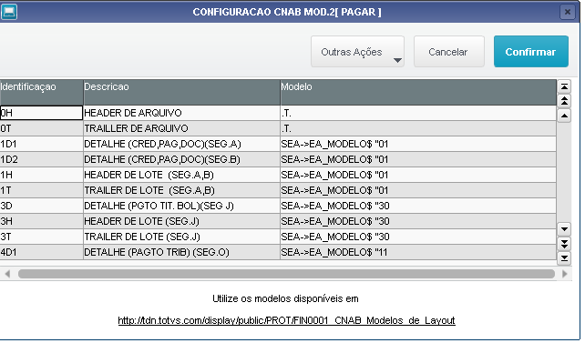
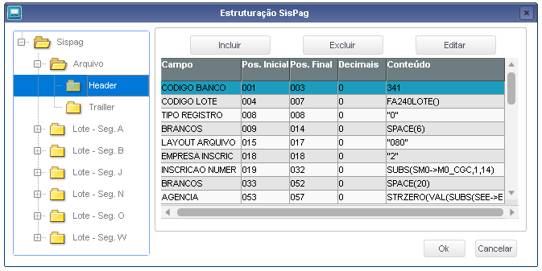

# CNABS
Arquivos CNAB Remessa/Retorno 240 e 400 posições do Contas a (Pagar e Receber)

# Contas a Pagar Modelo 240 posições

Este repositório tem como objetivo servir de base de conhecimento para auxiliar na montagem do CNAB em modelos 240 Posições.

# Contas a Receber Modelo 400 posições

Este repositório tem como objetivo servir de base de conhecimento para auxiliar na montagem do CNAB em modelos 400 Posições.

# Contas a Pagar e Folha de Pagamento SISPAG

Este repositório tem como objetivo servir de base de conhecimento para auxiliar na montagem do CNAB em modelos SISPAG E FOLHA.

